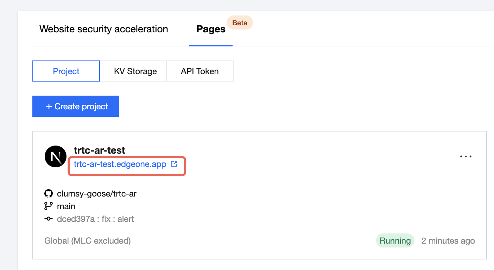
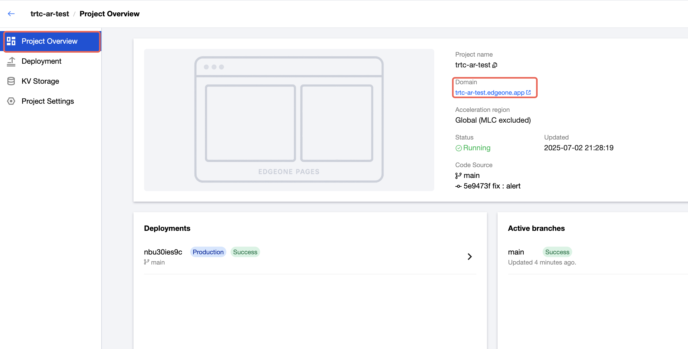
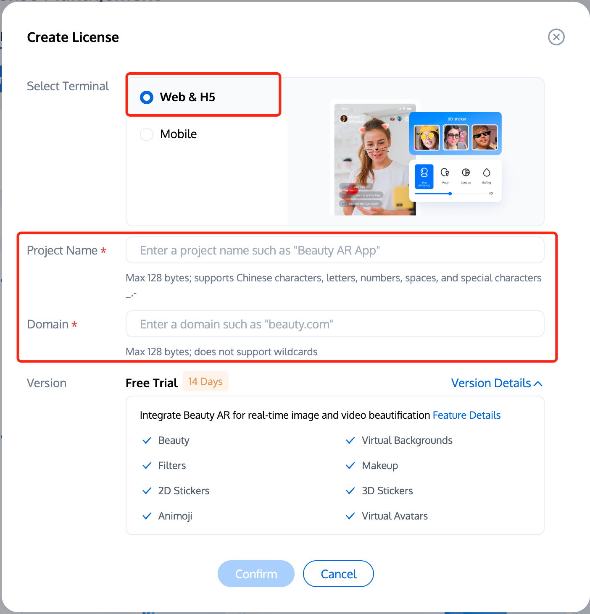
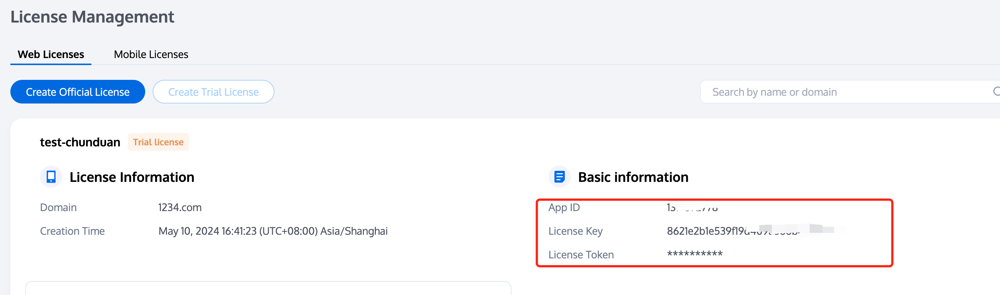
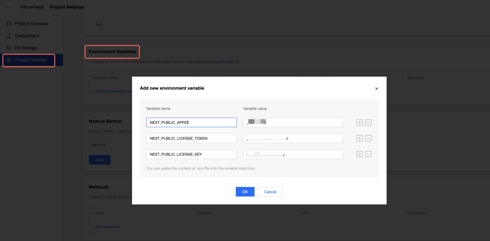
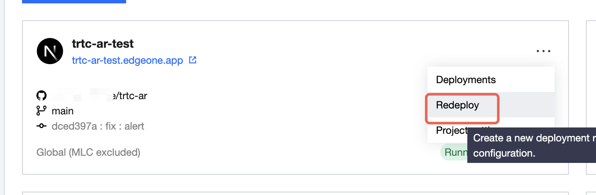
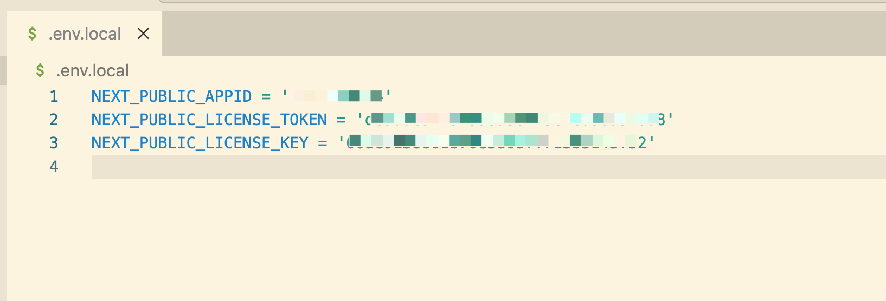

# Web  Beauty Template

This template supports Tencent's Web Beauty Filters, allowing you to experience various beauty effects.

## Deploy to EdgeOne Pages

### 1. Deploy to Edgeone Pages and get the project preview link address

[](https://console.tencent.com/edgeone/pages/new?template=trtc-ar)

You can copy the project domain in the project list


Or copy the project domain name in the project overview

**Be careful not to use the preview address domain  of the deployment record. Each time you redeploy, a new deployment record will be generated and bound to a new domain. The domain of each deployment record is different, and the preview address of the project is fixed. You can view the latest deployment results by visiting the preview address of the project.**

### 2. Create a license，Getting App ID,License Key and Licene Token

   Reference Documentation ：[Getting Web Beauty LIcense](https://trtc.io/document/68777?platform=web&product=beautyar)

1. **Create a license**
   Log in to [TRTC Console &gt; Beauty AR](https://console.trtc.io/beauty/license), and click **Create Trial License**
   Select Web&H5, and fill in the Project Name and Domain obtained in the first step. Once completed, click Confirm.
2. **Getting App ID, License Key and License Token**
   Getting the  App ID, License Key and License Token from [License Management](https://console.trtc.io/beauty/license).
   
   **Web Domain:** The domain information entered during project creation. The license can be used only under this domain or development environment.

### 3.  Set environment variables and redeploy

1. Add environment variables in Edgeone Pages console **Project Settings/Environment Variables**

   ```
   NEXT_PUBLIC_APPID = 'your App ID'
   NEXT_PUBLIC_LICENSE_TOKEN = 'your License Token'
   NEXT_PUBLIC_LICENSE_KEY = 'your License Key'
   ```

   
   **2. After redeployment, visit the project preview link again
   **

## 本地开发

### 项目依赖安装

```sh
npm install
```

### 设置环境变量

#### 1. 获取环境变量

[获取 Web 美颜特效的 License 和 APPID](https://cloud.tencent.com/document/product/616/71364)

#### 2. 创建.env.local文件



#### 3. 在.env.local写入环境变量：

```
NEXT_PUBLIC_APPID = '你的腾讯云APPID'
NEXT_PUBLIC_LICENSE_TOKEN = '你的 Web License Token'
NEXT_PUBLIC_LICENSE_KEY = '你的 Web License Key'
```

### 生产环境打包

```sh
npm run build
```
